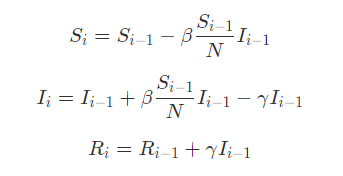
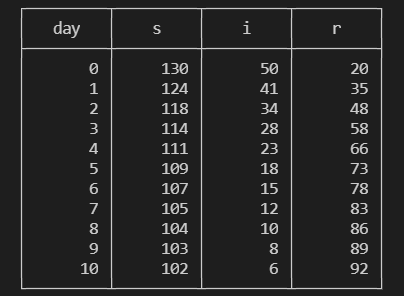
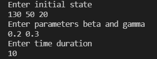
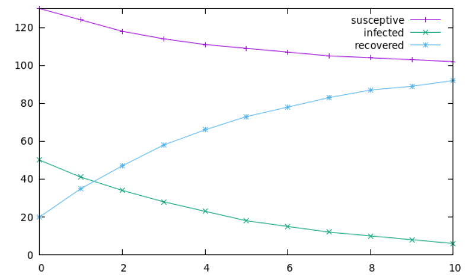

# Simulazione di un'Epidemia
 <i>Relazione di Sara Kostadinovic. </i>

Questo programma permette di simulare un'epidemia seguendo il modello SIR, stampare i dati ottenuti all'interno di una tabella sul terminale e inserirli all'interno di un grafico.

## 1. Header e Source file  
Il file <i>sir.hpp</i> presenta la dichiarazione della struct State, composta dai tre elementi corrispondenti al numero di suscettibili, di infetti e di guariti, e della classe Epidemic.

Nella parte privata di quest'ultima vi sono due attributi, uno di tipo State e l'altro che rappresenterà la durata della simulazione, entrambi inizializzati nel costruttore Epidemic.

Nella parte pubblica, invece, si trova la funzione `generation` di tipo State responsabile della generazione di nuovi stati e definita nel file <i>sir.cpp</i>. Essa assegna ad un oggetto di tipo State dei nuovi valori di `state.s`, `state.i` e `state.r` seguendo le seguenti equazioni 

e ritorna i nuovi valori.

## 2. Main file
Il file <i>main.cpp</i> si occupa dell'effettiva generazione e della successiva stampa dei valori ottenuti giorno per giorno.

Innanzitutto sono state usate delle lamba function per guidare l'input di stato iniziale, parametri e durata della simulazione. Per ognuno di questi valori è stata creata una try case per imporre dei limiti sui valori di input. Infatti per un corretto funzionamento del programma è impossibile accettare valori non positivi per gli elementi dello stato iniziale e valori non compresi tra 0 e 1 per i parametri dell'espansione; inoltre anche la durata della generazione deve essere espressa tramite un numero intero.

Successivamente vi è la parte della generazione, della quale si occupa la funzione print. Viene preso un oggetto di tipo Epidemic caratterizzato dallo stato iniziale e dalla durata della simulazione forniti in input e chiamando print vengono stampati questi primi valori. 

<i>Si fa notare che lo stato iniziale corrisponde al giorno 0; ciò è volto a facilitare il plotting degli stati ottenuti usando gnuplot. </i>

Per procedere con la generazione e con la stampa viene utilizzato un <i>ciclo for</i>. Per ogni giorno della simulazione viene chiamata la funzione `generation` e vengono riassegntia agli stati dell'oggetto dei nuovi valori, che vengono successivamente stampati in una tabella di questo tipo:

Infine è presente anche una parte di codice legata al plotting dei dati su un grafico. Usando la libreria <i>fstream</i> si creano tre file che saranno riempiti all'interno del ciclo for. Il primo file conterrà il numero di suscettibili giorno per giorno, il secondo gli infetti e il terzo i guariti. I contenuti di questi tre file verranno infine graficati.

## 3. Testing
Il progetto include anche il file <i>sir.test.cpp</i> che si occupa di testare che innanzitutto il numero totale di elementi della simulazione, ovvero la somma tra suscettibili, infetti e guariti, rimanga costante. 
Una seconda test case, invece, controlla che l'epidemia si stia espandendo in una sola direzione, ovvero da <b>s</b> a <b>i</b> a <b>r</b>, e che non si torni indietro.

## 4. Clang Format
All'interno della cartella è anche presente il file <i>.clang-format</i> che permette di formattare i file contententi parti di codice.

## 5. Istruzioni per la compilazioni
Per compilare il programma con CMake occore digitare sul terminale 

`$ cmake -DCMAKE_BUILD_TYPE=Debug -S . -B build` 

`$ cmake --build build`. 

Poi per osservare il funzionamento del programma: 

`$ build/sir` 

e in risposta viene chiesto un input che verrà dato seguendo il seguente scherma:

e scegliendo a piacere dei valori rispettando i limiti sopra elencati.

I test, invece, vengono eseguiti con 

`$ build/sir.t`. 

## 5. Plotting
Se si ha scaricato gnuplot è, inoltre, possibile visualizzare i dati ottenuti dalla generazione su un grafico. Per fare ciò si lavorerà esclusivamente da terminale.

I comandi da eseguire sono i seguenti:

`$ gnuplot` 

per accedere all'interfaccia di gnuplot

`gnuplot> plot [0:x][0:y] \` 

`gnuplot> "file_s.dat" with linespoint title "susceptive", "file_i.dat" with linespoint title "infected", "file_r.dat" with linespoint title "recovered"` 

dove `[0:x]` rappresenta il range dell'asse delle x, ovvero quello del tempo, e `[0:y]` quello dell'asse delle y, ovvero quello degli stati. Per una visualizzazione più pulita si consiglia di impostare 

x = durata della simulazione in giorni

y = massimo valore presente nella tabella che contiene tutti gli stati generati

Seguendo queste indicazioni si genererà un grafico di questo tipo:

Nel caso si presenti questo messaggio:

`(gnuplot:12604): Gtk-WARNING **: 08:01:47.879: Error loading theme icon 'edit-paste' for stock: Icon 'edit-paste' not present in theme Yaru`

`(gnuplot:12604): Gtk-WARNING **: 08:01:47.884: Error loading theme icon 'document-save-as' for stock: Icon 'document-save-as' not present in theme Yaru`

occorre installare o aggiornare `yaru-theme-icon` per disfarsene. Per fare ciò bisogna uscire dall'interfaccia di gnuplot e digitare `sudo apt install yaru-theme-icon` sul terminale.
I warning sopra citati, tuttavia, non impediscono il normale funzionamento del programma.

## 6. Cambiamenti rispetto al codice precedente
Sono state apportate diverse modifiche rispetto al codice precedente.

Innanzitutto prima la funzione che si occupata della generazione degli stati si chiamava `generate_simultion` ed era di tipo std::vector. La generazione avveniva completamente al suo interno tramite l'utilizzo di un ciclo for e il file main presentava solamente la stampa degli elementi del contenitore con un ciclo range-for. Ora, invece, si è scelto di renderla di tipo State in modo che questa si limiti a riassegnare ad uno stato dei valori diversi seguendo le formule e l'iterazione avviene nel ciclo for all'interno del file main. 

La seconda modifica è stata alla funzione `print` presente nel file main. Precedentemente prevedeva un ciclo range-for per stampare tutti gli stati all'interno del vettore mentre ora la funzione viene iterata nel ciclo for insieme a `generate`. Infatti, ogni volta che avviene la riassegnazione quello stato viene stampato subito dopo. Inoltre, la funzione print è stata modificata in modo che vengano stampati anche i giorni corrispondenti  a ciascuno stato nella tabella, partendo dallo stato iniziale che corrisponde al giorno 0.

Sempre nel file main sono state aggiunte delle funzioni lambda che forniscono dei messaggi all'utente per fargli sapere quale dei valori deve mandare in input. Inoltre, per validare l'input in precedenza erano stati utilizzati degli assert, che sono stati sostituiti da tre try cases.

Infine, l'aggiunta principale è la presenza di un parte grafica che permette di graficare i risultati ottenuti dalla generazione ed osservare la progressione dell'epidemia nel tempo. Per fare ciò si è deciso di adoperare gnuplot e lavorare prevalentemente da terminale per quanto possibile.
